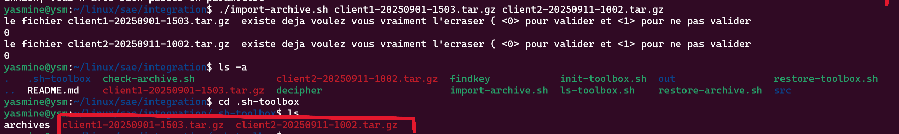
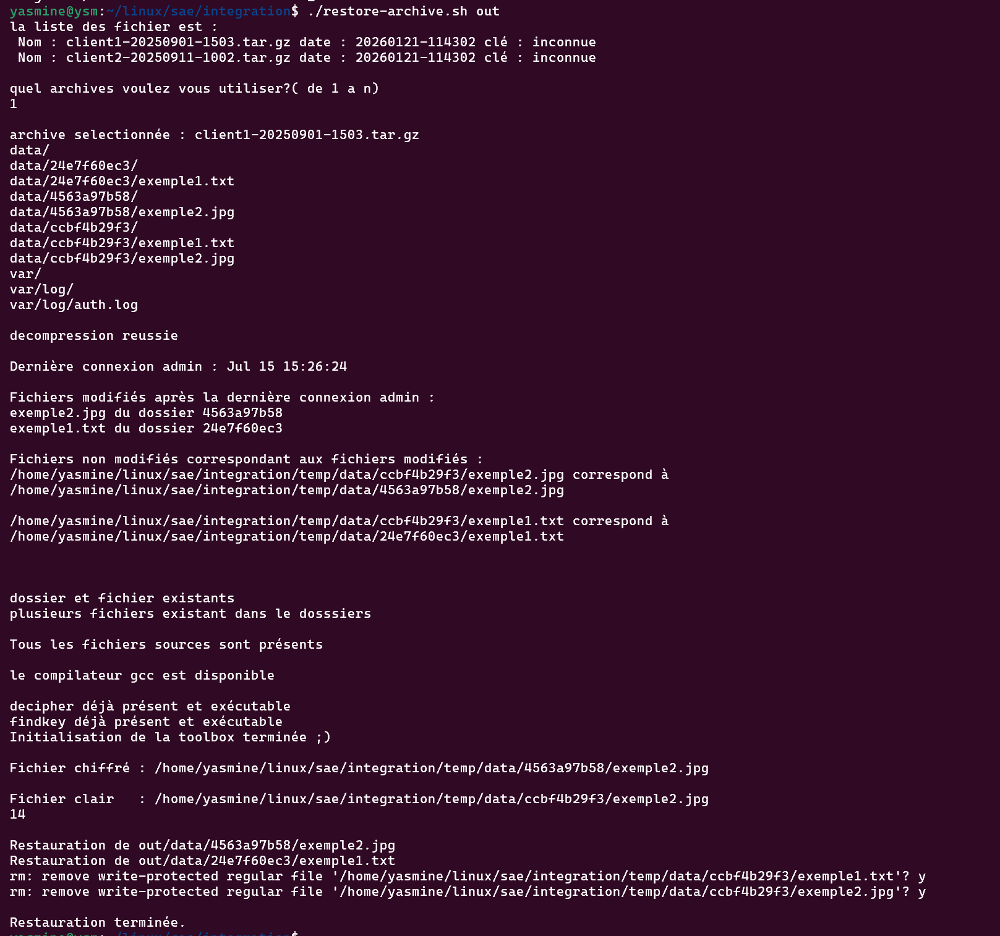
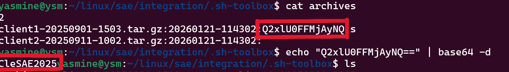
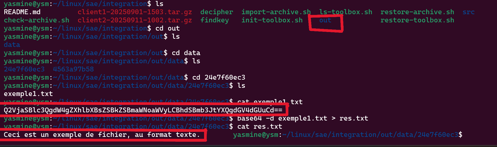

### 📂 Importation de l’archive

photo montrant l importation des deux archives depuis le dossier courant vers le dossier  caché  .sh-toolbox

### 🔓 Restauration de l’archive

Les fichiers chiffrés sont traités par les scripts Bash et les programmes C pour lancer la restauration.
ps:( 14 est le nombre de caractères de la clé en BASE64)

### 🔑 Récupération de la clé

La clé de chiffrement est automatiquement retrouvée grâce à l’analyse du chiffrement Vigenère en Base64.

### 📄 Fichier déchiffré

Le fichier est correctement restauré et lisible après le processus de déchiffrement.
