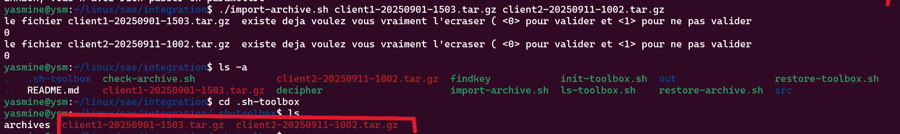
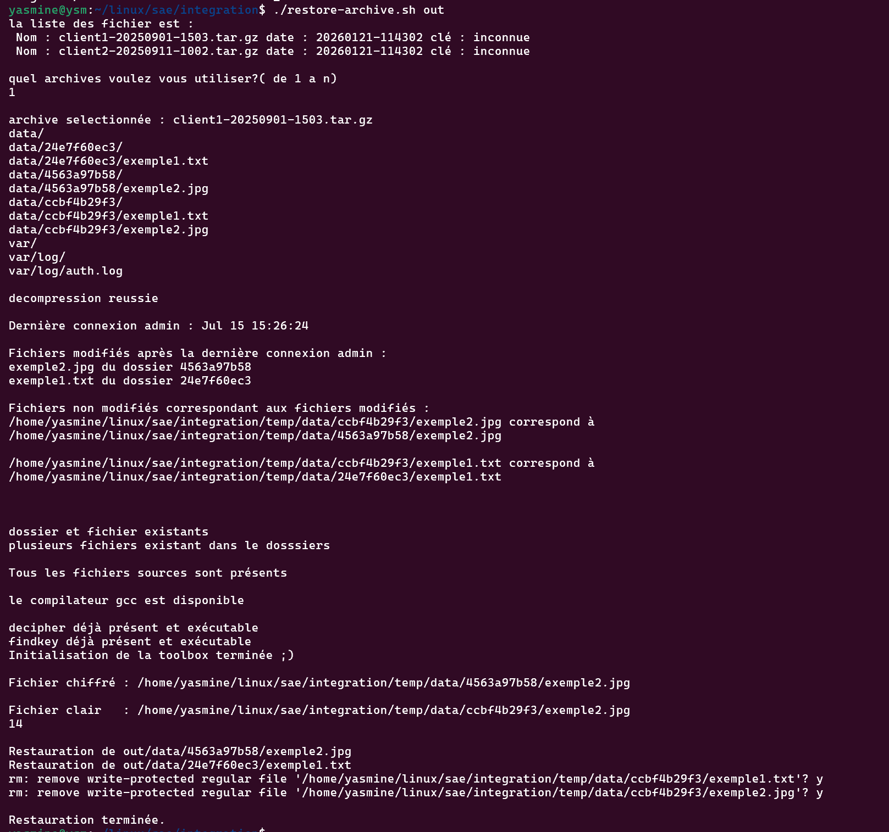
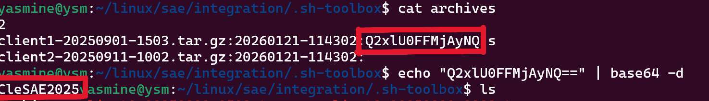
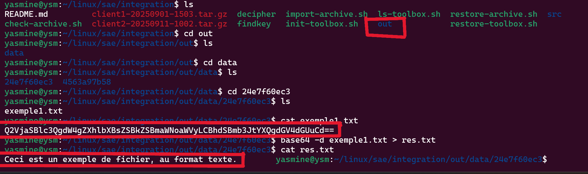

### 📂 Archive Import

Screenshot showing the import of the two archives from the current directory into the hidden folder `.sh-toolbox`.

### 🔓 Archive Restoration

The encrypted files are processed by the Bash scripts and C programs to initiate the restoration.
*(Note: 14 is the number of characters in the BASE64 key)*

### 🔑 Key Recovery

The encryption key is automatically recovered through the analysis of the Base64 Vigenère cipher.

### 📄 Decrypted File

The file is successfully restored and readable following the decryption process.
